<div align="center">

# ☁️ High Availability WordPress & Static Website Deployment on AWS

**A fully production-grade, multi-AZ AWS infrastructure — built end-to-end from scratch**

[](https://wordpress.ananthu.shop/)
[](https://static.ananthu.shop/)
[](https://github.com/YOUR_GITHUB_USERNAME)


</div>

---

## 📌 Project Overview

This project demonstrates the design and deployment of a **highly available, secure, and scalable web hosting architecture** on AWS. The infrastructure hosts:

- A **WordPress application** served behind an Application Load Balancer with HTTPS, Auto Scaling, shared EFS storage, and a private RDS MySQL database
- A **static website** served globally through CloudFront CDN with an S3 origin protected by Origin Access Control (OAC)

All infrastructure was provisioned manually through the AWS Console as a hands-on learning project during an internship at **EPI-USE, Kochi**.

---

## 🏗️ Architecture Diagram

```
                              INTERNET
                                 │
                        ┌────────▼────────┐
                        │    Route 53     │   ananthu.shop
                        │   DNS Records   │
                        └──┬──────────┬───┘
                           │          │
                  ┌─────────▼──┐  ┌───▼────────────┐
                  │    ALB     │  │   CloudFront    │
                  │ HTTPS:443  │  │   Distribution  │
                  │ HTTP→HTTPS │  └──────┬──────────┘
                  └─────┬──────┘         │
                        │           ┌────▼────┐
           ┌────────────▼──────┐    │   S3    │  static.ananthu.shop
           │   Auto Scaling    │    │  Bucket │  (OAC Protected)
           │   Group (ASG)     │    └─────────┘
           │   Min:1 / Max:2   │
           └──┬─────────────┬──┘
              │             │
      ┌────────▼──┐   ┌──────▼────┐
      │EC2 (AZ-1a)│   │EC2 (AZ-1b)│  Amazon Linux 2023
      │Public SNa │   │Public SNb │  Apache + PHP + WordPress
      │10.152.50.0│   │10.152.50. │  SSM Agent (No SSH)
      │    /25    │   │  128/25   │
      └────────┬──┘   └──────┬────┘
               │             │
           ┌───▼─────────────▼────┐
           │        EFS           │  Elastic File System
           │  /var/www/html mount │  Shared WordPress Files
           │  fs-0615122637d534   │  Encrypted + Auto Backup
           └──────────┬───────────┘
                      │
           ┌──────────▼───────────┐
           │   RDS MySQL          │  ananthu-rds-exam-2-aws
           │   Private Subnet C   │  Port 3306
           │   10.152.51.0/25     │  No Public Access
           │   Private Subnet D   │
           │   10.152.51.128/25   │
           └──────────────────────┘

┌─────────────────────────────────────────────────┐
│              VPC: ananthu-vpc                   │
│              CIDR: 10.152.50.0/23               │
│                                                 │
│  PUBLIC SUBNETS          PRIVATE SUBNETS        │
│  ├─ SNa 10.152.50.0/25   ├─ SNc 10.152.51.0/25  │
│  └─ SNb 10.152.50.128/25 └─ SNd 10.152.51.128/25│
│                                                 │
│  ROUTE TABLES            SECURITY GROUPS        │
│  ├─ public-RT → IGW      ├─ ananthu-ALB-SG      │
│  └─ private-RT (local)   ├─ ananthu-EC2-SG      │
│                           ├─ ananthu-NFS-EFS-SG  │
│  INTERNET GATEWAY         └─ ananthu-RDS-SG      │
│  └─ ananthu-IGW                                  │
└─────────────────────────────────────────────────┘
```

---

## 🧰 AWS Services Used

| # | Service | Role in This Project |
|---|---------|----------------------|
| 1 | **VPC** | Custom isolated network — `10.152.50.0/23` |
| 2 | **EC2** | Application servers running WordPress (Amazon Linux 2023) |
| 3 | **EFS** | Shared `/var/www/html` filesystem across all EC2 instances |
| 4 | **RDS MySQL** | Managed database in private subnets — no public access |
| 5 | **ALB** | Load balancer with HTTPS termination across both AZs |
| 6 | **ASG** | Auto Scaling Group — self-healing, min 1, max 2 instances |
| 7 | **ACM** | Free SSL/TLS certificates for `wordpress.ananthu.shop` |
| 8 | **SSM** | Keyless EC2 access via Session Manager (no port 22) |
| 9 | **Route 53** | DNS records — CNAME for ALB and CloudFront |
| 10 | **S3** | Static website hosting with versioning |
| 11 | **CloudFront** | Global CDN with OAC — blocks direct S3 access |
| 12 | **AWS Backup** | Automated backup policies for data protection |
| 13 | **IAM** | Role-based access — SSM policy attached to EC2 |

---

## 📋 Implementation — Step by Step

---

### Step 1 — VPC & Network Architecture

**Objective:** Build a secure, logically isolated network with public and private subnet tiers across multiple Availability Zones.

**Actions performed:**

A custom VPC (`ananthu-vpc`) was created with CIDR block `10.152.50.0/23`, providing a 512-IP address space. Four subnets were provisioned across four Availability Zones:

| Subnet Name | CIDR | Type | Availability Zone |
|---|---|---|---|
| ananthu-public-SNa | 10.152.50.0/25 | Public | us-east-1a |
| ananthu-public-SNb | 10.152.50.128/25 | Public | us-east-1b |
| ananthu-private-SNc | 10.152.51.0/25 | Private | us-east-1c |
| ananthu-private-SNd | 10.152.51.128/25 | Private | us-east-1d |

An **Internet Gateway** (`ananthu-IGW`) was created and attached to the VPC. Two route tables were configured:
- `ananthu-public-RT` — associated with both public subnets, with a `0.0.0.0/0` route pointing to the IGW
- `ananthu-private-RT` — associated with both private subnets, containing only the local VPC route (no internet access)

Four dedicated **Security Groups** were created, each scoped to a specific tier:
- `ananthu-ALB-SG` — permits inbound HTTP/HTTPS from the internet
- `ananthu-EC2-SG` — permits inbound traffic only from the ALB security group
- `ananthu-NFS-EFS-SG` — permits NFS (port 2049) inbound only from EC2 security group
- `ananthu-RDS-SG` — permits MySQL (port 3306) inbound only from EC2 security group

**Why this design:** The tiered subnet model enforces network-level separation. Internet traffic enters through the public subnets and ALB, reaches EC2 instances, which then connect inward to EFS and RDS. The database is completely unreachable from the internet at the network layer — not just by firewall rule, but by routing design.

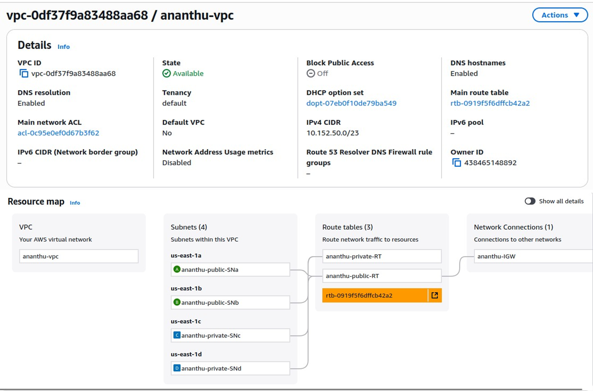
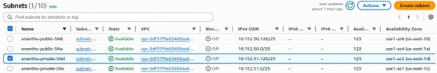
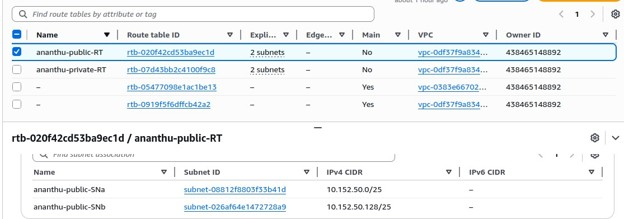
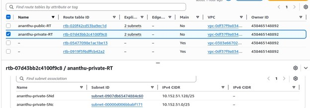
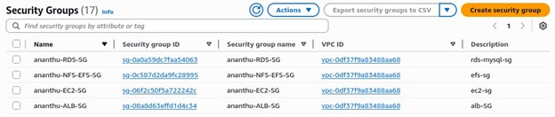

---

### Step 2 — RDS MySQL in Private Subnets

**Objective:** Deploy a fully managed relational database that is accessible only by application servers, never by the public internet.

**Actions performed:**

An **Amazon RDS MySQL** instance was launched with the following configuration:

| Parameter | Value |
|---|---|
| Instance ID | ananthu-rds-exam-2-aws |
| Engine | MySQL |
| Port | 3306 |
| VPC | ananthu-vpc |
| Subnet Group | ananthu-sng-rds (private subnets only) |
| Publicly Accessible | ❌ No |
| Security Group | ananthu-RDS-SG |
| Network Type | IPv4 |

The RDS instance was placed in the private subnet group (`ananthu-sng-rds`) spanning subnets in us-east-1c and us-east-1d, ensuring the database has no route to or from the internet.

**Why this design:** A database with `Publicly Accessible: No` combined with a private subnet placement means there is no network path from the internet to port 3306 — even if a security group rule were accidentally misconfigured, the routing layer would still block external access. This is defence-in-depth.

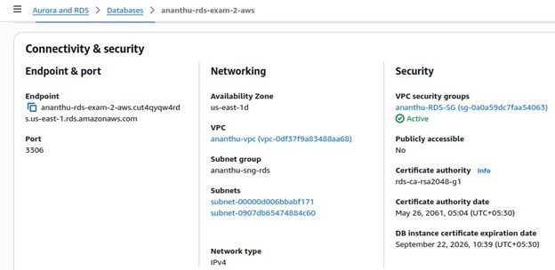

---

### Step 3 — EC2 Launch with SSM (No SSH Keys)

**Objective:** Launch the application server using AWS Systems Manager for access, eliminating SSH key management and closing port 22 entirely.

**Actions performed:**

An **Amazon Linux 2023** EC2 instance was launched inside `ananthu-vpc` on `ananthu-public-SNa` (us-east-1a). An IAM instance profile with the `AmazonSSMManagedInstanceCore` policy was attached at launch time.

Access to the instance was performed entirely through **AWS Session Manager** — a browser-based shell accessible from the EC2 console. No key pair was created. Port 22 was not open in the security group.

**Why this design:** Traditional SSH access requires managing key pairs, keeping port 22 open, and trusting the network path. SSM eliminates all three risks. Every session is fully logged to CloudWatch, providing a complete audit trail of all commands run on the server — a requirement in any security-conscious environment.

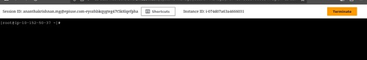

---

### Step 4 — EFS Mount & WordPress Installation

**Objective:** Create a shared, persistent, elastic file system mounted on all EC2 instances so that WordPress files are identical across the entire Auto Scaling Group.

**Actions performed:**

**Amazon EFS** was created with the following configuration:

| Parameter | Value |
|---|---|
| File System ID | fs-0615122637d534178 |
| Performance Mode | General Purpose |
| Throughput Mode | Bursting |
| Encryption at Rest | ✅ Enabled |
| Automatic Backups | ✅ Enabled |

The EFS file system was mounted on the EC2 instance at `/var/www/html` using a permanent entry in `/etc/fstab`:

```
fs-0615122637d534178:/ /var/www/html efs defaults,_netdev 0 0
```

The `_netdev` flag ensures the mount waits for network availability before mounting during boot — critical for cloud instances that mount network file systems.

WordPress, Apache, PHP, and the MySQL client were installed. WordPress files were placed directly in `/var/www/html` (on the EFS mount). The `wp-config.php` file was configured with the RDS endpoint as `DB_HOST`:

```php
define('DB_NAME', 'wordpress');
define('DB_USER', 'admin');
define('DB_HOST', 'ananthu-rds-exam-2-aws.cut4qyqw4rds.us-east-1.rds.amazonaws.com');
```

WordPress was verified to load correctly via the EC2 public IP.

**Why this design:** Without a shared file system, each EC2 instance behind a load balancer maintains its own independent `/var/www/html`. Any media upload, plugin installation, or theme change made on instance A would be absent from instance B. EFS makes every instance stateless and identical — the file system is the single source of truth, not the instance.

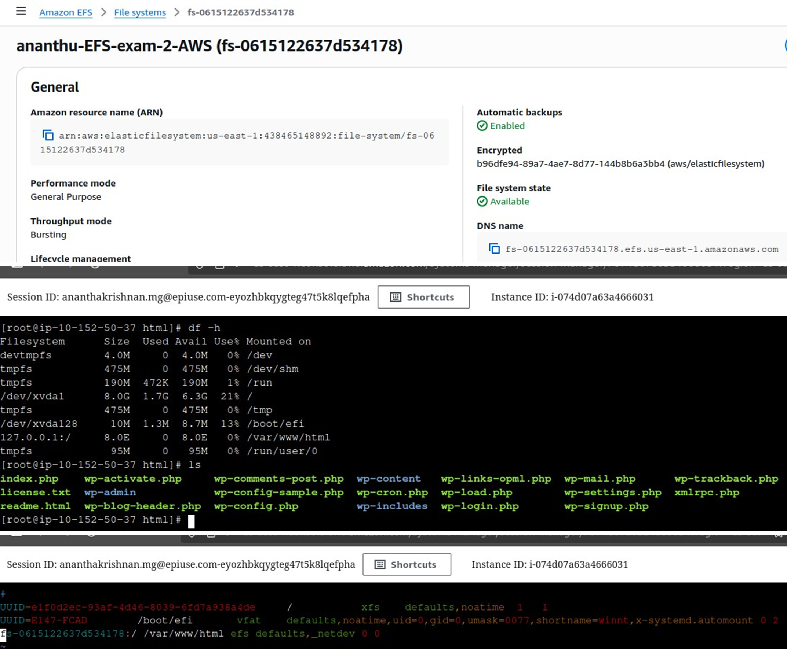
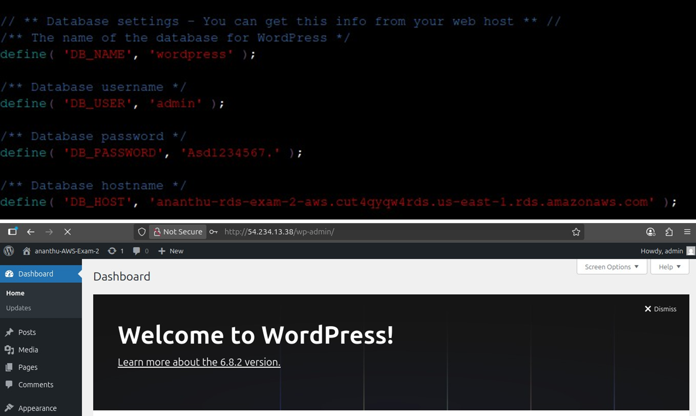

---

### Step 5 — AMI Creation & Multi-AZ Validation

**Objective:** Capture the fully configured instance as a reusable AMI and validate that the architecture works correctly across multiple Availability Zones.

**Actions performed:**

A custom **Amazon Machine Image (AMI)** was created from the configured EC2 instance:

| Parameter | Value |
|---|---|
| AMI Name | ananthu-exam-2-aws-ami-wordpress |
| AMI ID | ami-0febbbdfdd1654f80 |
| Platform | Linux/UNIX |
| Architecture | x86_64 |
| Virtualization | HVM |

A second EC2 instance was launched from this AMI in `ananthu-public-SNb` (us-east-1b) — a completely separate Availability Zone. The WordPress site was verified to load correctly from this second instance's public IP, confirming that:
- The EFS mount was working cross-AZ
- The RDS connection was working from a different subnet
- The AMI produced an identical, functional instance

**Why this design:** The AMI is the foundation of the Auto Scaling Group. By verifying it works in a second AZ before attaching it to the ASG, we confirm the entire architecture is truly cross-AZ redundant — not just on paper.

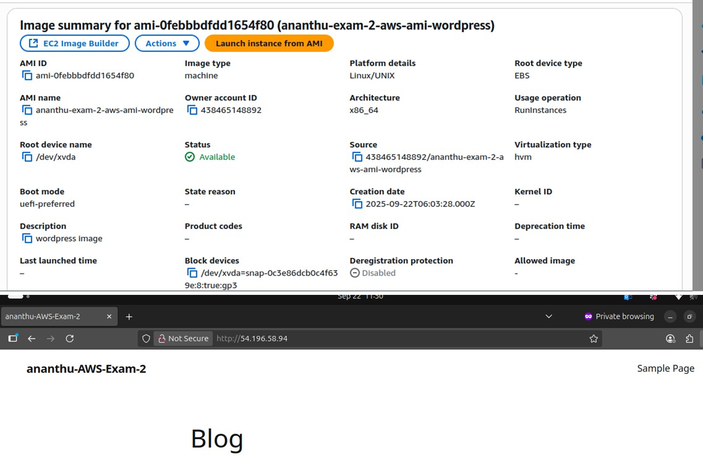

---

### Step 6 — Application Load Balancer with HTTPS (ACM)

**Objective:** Front both EC2 instances with a managed load balancer, enforce HTTPS everywhere, and terminate SSL at the ALB layer using a free certificate from ACM.

**Actions performed:**

An **Application Load Balancer** (`ananthu-exam-2-ALB`) was created:

| Parameter | Value |
|---|---|
| Type | Application, Internet-facing |
| Availability Zones | us-east-1a (public SNa), us-east-1b (public SNb) |
| Security Group | ananthu-ALB-SG |

An SSL/TLS certificate was requested and issued by **AWS Certificate Manager (ACM)** for the domain `wordpress.ananthu.shop`. DNS validation was completed via a CNAME record in Route 53 — status confirmed as **Issued ✅**.

Two listeners were configured on the ALB:

| Listener | Action |
|---|---|
| HTTPS:443 | Forward to target group `ananthu-exam-2-TG` |
| HTTP:80 | Redirect to `HTTPS://#{host}:443/#{path}?#{query}` (301) |

The target group registered 3 healthy instances across both AZs, all showing **Healthy** status in the health checks.

**Why this design:** The ALB serves as the single entry point for all web traffic. Health checks automatically route around failed instances. ACM-issued certificates renew automatically — there is no manual certificate management, no expiry risk, and no cost for the certificate itself.

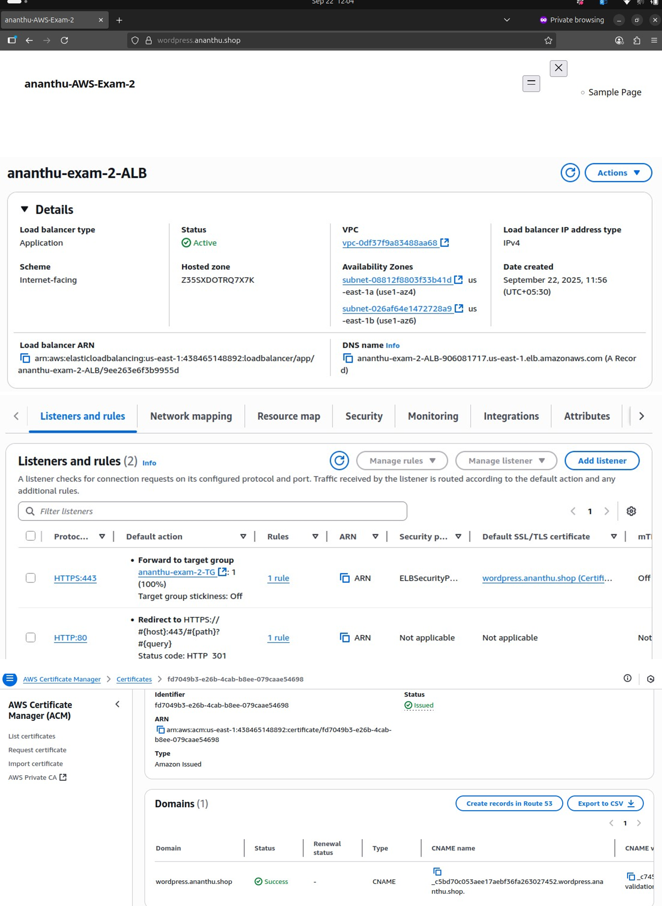

---

### Step 7 — Auto Scaling Group

**Objective:** Configure the infrastructure to automatically recover from instance failures and scale capacity in response to load.

**Actions performed:**

An **Auto Scaling Group** (`ananthu-ASG-exam-2`) was created using the WordPress AMI as the launch template:

| Parameter | Value |
|---|---|
| Launch Template | ananthu-exam-2-aws-ami-wordpress |
| Desired Capacity | 1 |
| Minimum | 1 |
| Maximum | 2 |
| Target Group | ananthu-exam-2-TG (ALB) |
| AZs | us-east-1a, us-east-1b |

The ASG was confirmed to have successfully launched a new EC2 instance and registered it with the ALB target group — activity history shows status **Successful**.

**Why this design:** The ASG is what separates a manually managed server from a self-healing infrastructure. If the running instance fails an ALB health check, the ASG terminates it and launches a replacement automatically. Under a traffic spike, it can scale out to 2 instances. The infrastructure runs itself.

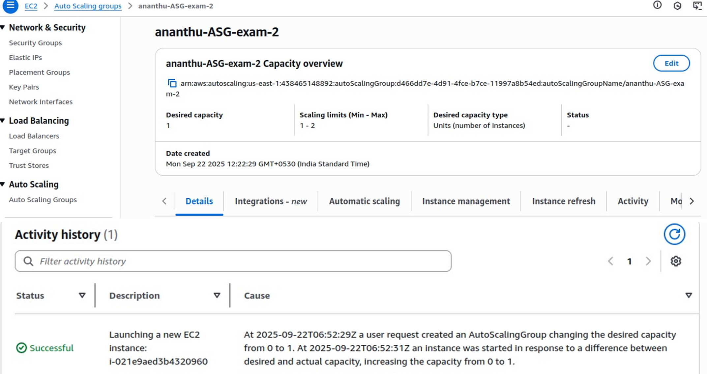
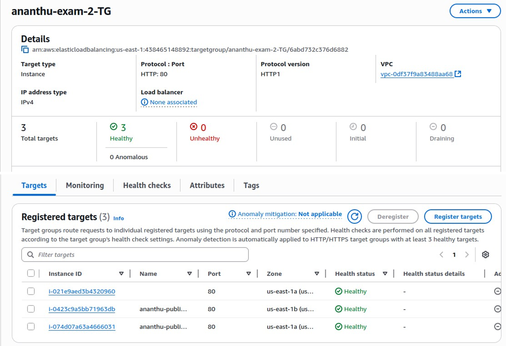

---

### Step 8 — Route 53 DNS & Live WordPress Domain

**Objective:** Map the human-readable domain `wordpress.ananthu.shop` to the ALB using DNS, making the site publicly accessible with HTTPS.

**Actions performed:**

In the Route 53 hosted zone for `ananthu.shop`, a **CNAME record** was created:

| Record | Type | Value |
|---|---|---|
| wordpress.ananthu.shop | CNAME | ananthu-exam-2-ALB-906081717.us-east-1.elb.amazonaws.com |

WordPress was verified to load correctly at [https://wordpress.ananthu.shop/](https://wordpress.ananthu.shop/) with a valid, browser-trusted HTTPS certificate.

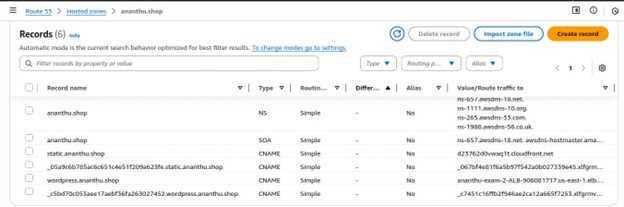
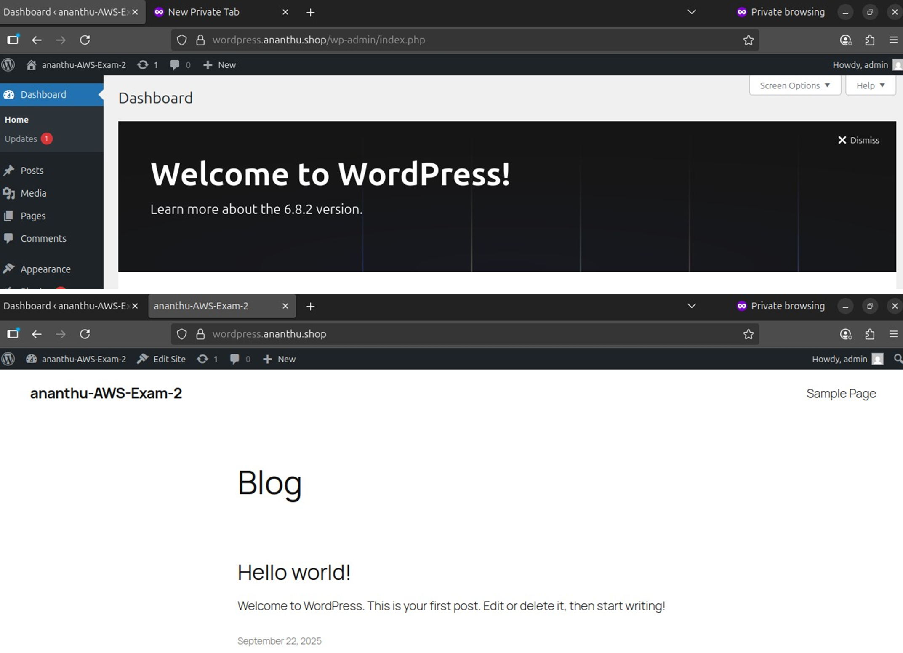

---

### Step 9 — S3 Static Website + CloudFront CDN with OAC

**Objective:** Host a static website with global CDN delivery, ensuring content is served only through CloudFront — never directly from the S3 bucket URL.

**Actions performed:**

**S3 Bucket Setup:**
- Created S3 bucket named `static.ananthu.shop` with versioning enabled
- Uploaded `index.html` as the static website content

**CloudFront Distribution:**
A CloudFront distribution was created with the following configuration:

| Parameter | Value |
|---|---|
| Distribution Name | static.ananthu.shop |
| Origin | static.ananthu.shop S3 bucket |
| Origin Access | Origin Access Control (OAC) — recommended |
| OAC Name | oac-static.ananthu.shop.s3.us-east-1.amazonaws.com |
| Custom Domain | static.ananthu.shop |
| SSL Certificate | ACM — static.ananthu.shop (Issued ✅) |
| Default Root Object | index.html |
| Price Class | All Edge Locations |
| HTTP Versions | HTTP/2, HTTP/1.1, HTTP/1.0 |

**Bucket Policy (OAC):**
The CloudFront-generated bucket policy was applied to the S3 bucket, granting access exclusively to the CloudFront service principal for this distribution:

```json
{
  "Version": "2008-10-17",
  "Id": "PolicyForCloudFrontPrivateContent",
  "Statement": [{
    "Sid": "AllowCloudFrontServicePrincipal",
    "Effect": "Allow",
    "Principal": { "Service": "cloudfront.amazonaws.com" },
    "Action": "s3:GetObject",
    "Resource": "arn:aws:s3:::static.ananthu.shop/*",
    "Condition": {
      "StringEquals": {
        "AWS:SourceArn": "arn:aws:cloudfront::438465148892:distribution/E19D1GDG0UD0P3"
      }
    }
  }]
}
```

A **CNAME record** in Route 53 mapped `static.ananthu.shop` → CloudFront distribution domain (`d23762d0vwaq1t.cloudfront.net`).

**Validation:**
- ✅ Direct S3 URL returns `AccessDenied` — bucket is correctly locked to CloudFront only
- ✅ CloudFront domain `https://static.ananthu.shop/` serves the site correctly with HTTPS

**Why this design:** OAC is the modern replacement for Origin Access Identity (OAI). It ensures that even if someone discovers your S3 bucket name, they cannot access any content directly. All traffic must pass through CloudFront — enabling caching, WAF protection, and access logging at the edge.

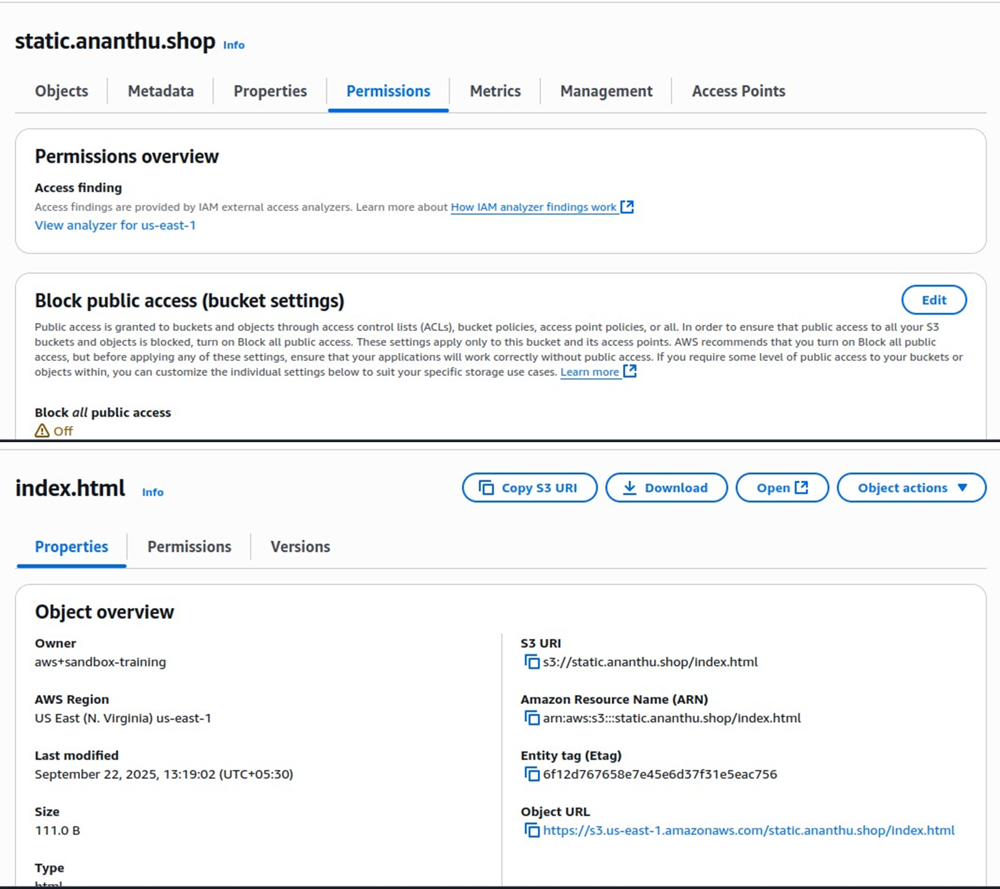
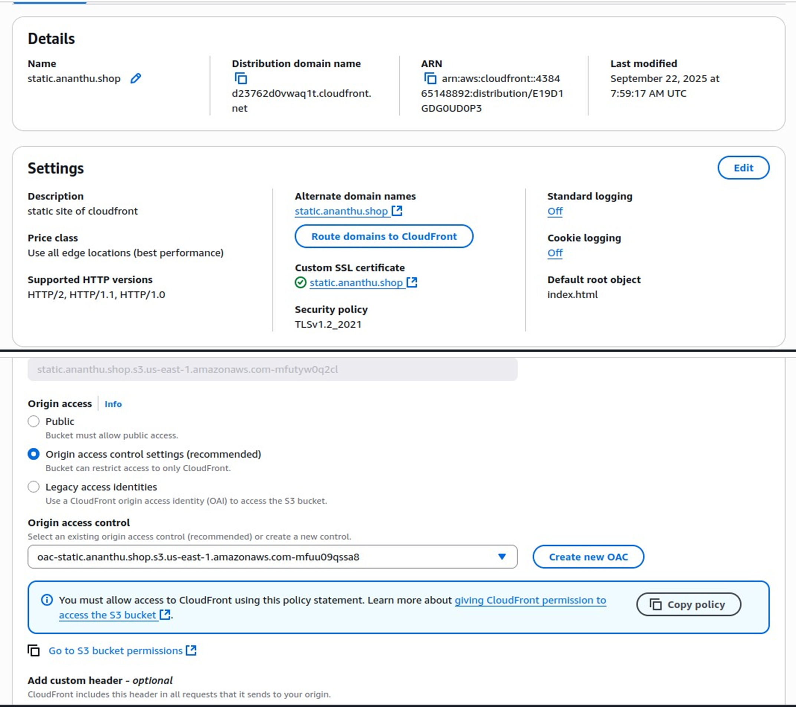
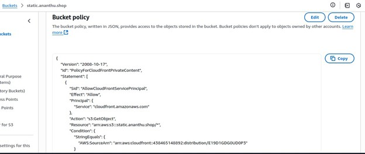
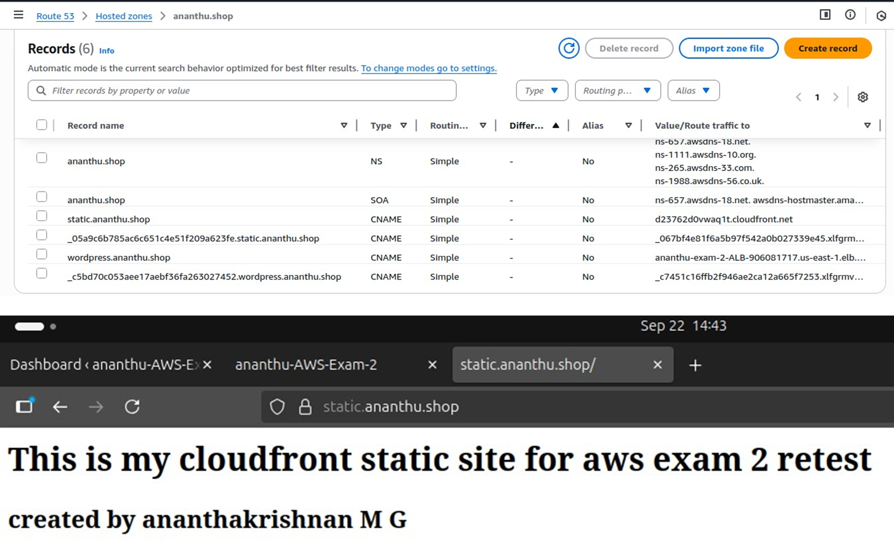
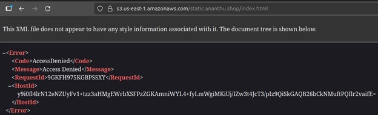

---


---

<div align="center">

**Built by [Ananthakrishnan M G](https://github.com/YOUR_GITHUB_USERNAME)**

[](https://github.com/YOUR_GITHUB_USERNAME)

</div>
